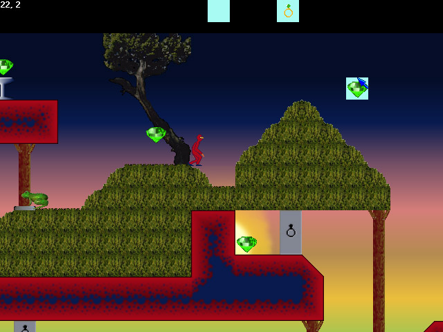

<div align="center">

## Scrolling Game Development Kit


</div>

### Description

A complete game development and playback kit geared toward 2-D scrolling games. Assists in creation of tile graphics, sprites and maps. Features include anti-aliased rotation function in the graphics editor, Maze generator and automatic tile matching in the map editor, animated tile support.

Features and technologies demonstrated in the code include:

Reading, parsing and writing XML using Microsoft's XMLDOMDocument COM object.

Creating and manipulating bitmaps (and StdPicture COM Picture objects) and graphics in memory and on the display using an HDC and GDI API.

Playing multimedia clips on a full screen DirectDraw display.

Drawing, moving, and interacting with a multi-layered parallax scrolling tiled map.

Using Cos and Sin to rotate graphics and rotate thrust (like Asteroids game).

Generating a maze with diagonal passages and variable passage sizes.

HTML help file and its linkage to a VB program.

Execute VBScript from a compiled executable, and connect events from internal objects to scripted event handlers (requires related DLL in this case).

Directly access any area of the registry (not just VB's area).

Easy reading of the joystick from a VB program without using external controls.

Creating shortcut files from VB using VB6STKIT.DLL or VB5STKIT.DLL (whichever may be available) and failing gracefully if neither exists.
 
### More Info
 
Optionally specify a project on the command line to load this project at startup. Optionally specify a VBS (VBScript) file on the command line with the "/p" (playback) or "/e" (edit) switch to control the program/game via scripting (not fully documented). Use "/d" switch to specity a bit depth for the full-screen displays. UI includes a feature to automatically create shortcuts which demonstrate how the command line works.

Press F1 key on any dialog for context sensitive help. Look in the help menu for short and long tutorials.

Planet-Source-Code requires that submitted source code be freely reusable WITHOUT RESTRICTION, so I hereby waive any terms of the GPL on this code that conflict with terms described in the "terms and conditions" as of the date of submission, if such conflicting terms exist. I do, however, maintain the copyright on the code and humbly request recognition where appropriate.

Game projects are stored as GDP files; the map data as MAP files; the graphics as BMP files, and multimedia clips (which can't be created from within the environment) as *.WAV, *.MP3, *.MPG, etc. A project (GDP and MAP files) can be exported to a single XML file.

Registry entries are created under HKEY_CLASSES_ROOT\.gdp, HKEY_CLASSES_ROOT\gdpfile, HKEY_CLASSES_ROOT\GameDev.*, HKEY_CURRENT_USER\Software\VB and VBA Program Settings\GameDev


<span>             |<span>
---                |---
**Submitted On**   |2001-03-22 15:14:18
**By**             |[Benjamin Marty](https://github.com/Planet-Source-Code/PSCIndex/blob/master/ByAuthor/benjamin-marty.md)
**Level**          |Advanced
**User Rating**    |4.7 (126 globes from 27 users)
**Compatibility**  |VB 6\.0
**Category**       |[Complete Applications](https://github.com/Planet-Source-Code/PSCIndex/blob/master/ByCategory/complete-applications__1-27.md)
**World**          |[Visual Basic](https://github.com/Planet-Source-Code/PSCIndex/blob/master/ByWorld/visual-basic.md)
**Archive File**   |[Scrolling 180284620\.zip](https://github.com/Planet-Source-Code/benjamin-marty-scrolling-game-development-kit__1-22201/archive/master.zip)

### API Declarations

```
' These declarations are part of the uploaded
' source code and can be found in GameDev.bas
Option Explicit
Public Type POINTAPI
  X As Long
  Y As Long
End Type
Public Type RECT
  Left As Long
  Top As Long
  Right As Long
  Bottom As Long
End Type
Public Type IID
 X As Long
 s1 As Integer
 s2 As Integer
 C(0 To 7) As Byte
End Type
Public Type PICTDESC
 cbSizeOfStruct As Long
 picType As Long
 hBitmap As Long
 hpal As Long
End Type
Public Type Size
  cx As Long
  cy As Long
End Type
Type BITMAPINFOHEADER '40 bytes
  biSize As Long
  biWidth As Long
  biHeight As Long
  biPlanes As Integer
  biBitCount As Integer
  biCompression As Long
  biSizeImage As Long
  biXPelsPerMeter As Long
  biYPelsPerMeter As Long
  biClrUsed As Long
  biClrImportant As Long
End Type
Type RGBQUAD
  rgbBlue As Byte
  rgbGreen As Byte
  rgbRed As Byte
  rgbReserved As Byte
End Type
Type RGBTRIPLE
  rgbtBlue As Byte
  rgbtGreen As Byte
  rgbtRed As Byte
End Type
Type BITMAPINFO
  bmiHeader As BITMAPINFOHEADER
  bmiColors As RGBQUAD
End Type
Type JOYINFOEX
  dwSize As Long     ' size of structure
  dwFlags As Long     ' flags to indicate what to return
  dwXpos As Long    ' x position
  dwYpos As Long    ' y position
  dwZpos As Long    ' z position
  dwRpos As Long     ' rudder/4th axis position
  dwUpos As Long     ' 5th axis position
  dwVpos As Long     ' 6th axis position
  dwButtons As Long    ' button states
  dwButtonNumber As Long  ' current button number pressed
  dwPOV As Long     ' point of view state
  dwReserved1 As Long     ' reserved for communication between winmm driver
  dwReserved2 As Long     ' reserved for future expansion
End Type
Public Const SRCCOPY = &HCC0020 ' (DWORD) dest = source
Public Const OBJ_PAL = 5
Public Const PICTYPE_BITMAP = 1
Public Const S_OK = &H0
Public Const WHITE_PEN = 6
Public Const WHITE_BRUSH = 0
Public Const BLACK_BRUSH = 4
Public Const DEFAULT_GUI_FONT = 17
Public Const DFC_BUTTON = 4
Public Const DFCS_BUTTONPUSH = &H10
Public Const DFCS_PUSHED = &H200
Public Const DT_CENTER = &H1
Public Const DT_VCENTER = &H4
Public Const DT_SINGLELINE = &H20
Public Const DT_WORDBREAK = &H10
Public Const DT_CALCRECT = &H400
Public Const Transparent = 1
Public Const LTGRAY_BRUSH = 1
Public Const DKGRAY_BRUSH = 3
Public Const FLOODFILLSURFACE = 1
Public Const NULL_BRUSH = 5
Public Const GRAY_BRUSH = 2
Public Const PS_SOLID = 0
Public Const PS_DASH = 1     ' -------
Public Const PS_DOT = 2      ' .......
Public Const RGN_OR = 2
Public Const BI_RGB = 0&
Public Const DIB_RGB_COLORS = 0 ' color table in RGBs
Public Const JOYERR_NOERROR = 0 ' no error
Public Const JOY_BUTTON1 = &H1
Public Const JOY_BUTTON2 = &H2
Public Const JOY_BUTTON3 = &H4
Public Const JOY_BUTTON4 = &H8
Public Const JOYSTICKID1 = 0
Public Const JOYSTICKID2 = 1
Public Const JOY_RETURNX = &H1&
Public Const JOY_RETURNY = &H2&
Public Const JOY_RETURNZ = &H4&
Public Const JOY_RETURNR = &H8&
Public Const JOY_RETURNU = &H10        ' axis 5
Public Const JOY_RETURNV = &H20        ' axis 6
Public Const JOY_RETURNPOV = &H40&
Public Const JOY_RETURNBUTTONS = &H80&
Public Const JOY_RETURNALL = (JOY_RETURNX Or JOY_RETURNY Or JOY_RETURNZ Or JOY_RETURNR Or JOY_RETURNU Or JOY_RETURNV Or JOY_RETURNPOV Or JOY_RETURNBUTTONS)
Public Const WS_CHILD = &H40000000
Public Const WS_VISIBLE = &H10000000
Private Const KEY_CREATE_SUB_KEY = &H4
Private Const KEY_QUERY_VALUE = &H1
Private Const KEY_SET_VALUE = &H2
Private Const ERROR_SUCCESS = 0&
Private Const REG_SZ = 1       ' Unicode nul terminated string
Private Const REG_BINARY = 3      ' Free form binary
Public Const Pi As Double = 3.14159265358979
Public Declare Function SelectObject Lib "gdi32" (ByVal hDC As Long, ByVal hObject As Long) As Long
Public Declare Function MoveToEx Lib "gdi32" (ByVal hDC As Long, ByVal X As Long, ByVal Y As Long, ByVal lpPoint As Long) As Long
Public Declare Function LineTo Lib "gdi32" (ByVal hDC As Long, ByVal X As Long, ByVal Y As Long) As Long
Public Declare Function Rectangle Lib "gdi32" (ByVal hDC As Long, ByVal X1 As Long, ByVal Y1 As Long, ByVal X2 As Long, ByVal Y2 As Long) As Long
Public Declare Function CreateCompatibleBitmap Lib "gdi32" (ByVal hDC As Long, ByVal nWidth As Long, ByVal nHeight As Long) As Long
Public Declare Function CreateCompatibleDC Lib "gdi32" (ByVal hDC As Long) As Long
Public Declare Function BitBlt Lib "gdi32" (ByVal hDestDC As Long, ByVal X As Long, ByVal Y As Long, ByVal nWidth As Long, ByVal nHeight As Long, ByVal hSrcDC As Long, ByVal xSrc As Long, ByVal ySrc As Long, ByVal dwRop As Long) As Long
Public Declare Function DeleteDC Lib "gdi32" (ByVal hDC As Long) As Long
Public Declare Function OleCreatePictureIndirect Lib "olepro32" (ByRef pPictDesc As PICTDESC, ByRef riid As IID, ByVal fOwn As Boolean, ByRef ppvObj As StdPicture) As Long
Public Declare Function DeleteObject Lib "gdi32" (ByVal hObject As Long) As Long
Public Declare Function GetCurrentObject Lib "gdi32" (ByVal hDC As Long, ByVal uObjectType As Long) As Long
Public Declare Function GetDC Lib "user32" (ByVal hwnd As Long) As Long
Public Declare Function ReleaseDC Lib "user32" (ByVal hwnd As Long, ByVal hDC As Long) As Long
Public Declare Function CreateSolidBrush Lib "gdi32" (ByVal crColor As Long) As Long
Public Declare Function GetPixel Lib "gdi32" (ByVal hDC As Long, ByVal X As Long, ByVal Y As Long) As Long
Public Declare Function FillRect Lib "user32" (ByVal hDC As Long, lpRect As RECT, ByVal hBrush As Long) As Long
Public Declare Function GetStockObject Lib "gdi32" (ByVal nIndex As Long) As Long
Public Declare Function DrawFrameControl Lib "user32" (ByVal hDC As Long, lpRect As RECT, ByVal un1 As Long, ByVal un2 As Long) As Long
Public Declare Function GetTextExtentPoint32 Lib "gdi32" Alias "GetTextExtentPoint32A" (ByVal hDC As Long, ByVal lpsz As String, ByVal cbString As Long, lpSize As Size) As Long
Public Declare Function DrawText Lib "user32" Alias "DrawTextA" (ByVal hDC As Long, ByVal lpStr As String, ByVal nCount As Long, lpRect As RECT, ByVal wFormat As Long) As Long
Public Declare Function SetBkMode Lib "gdi32" (ByVal hDC As Long, ByVal nBkMode As Long) As Long
Public Declare Function SetPixel Lib "gdi32" (ByVal hDC As Long, ByVal X As Long, ByVal Y As Long, ByVal crColor As Long) As Long
Public Declare Function CreatePen Lib "gdi32" (ByVal nPenStyle As Long, ByVal nWidth As Long, ByVal crColor As Long) As Long
Public Declare Function ExtFloodFill Lib "gdi32" (ByVal hDC As Long, ByVal X As Long, ByVal Y As Long, ByVal crColor As Long, ByVal wFillType As Long) As Long
Public Declare Function Ellipse Lib "gdi32" (ByVal hDC As Long, ByVal X1 As Long, ByVal Y1 As Long, ByVal X2 As Long, ByVal Y2 As Long) As Long
Public Declare Function SetBkColor Lib "gdi32" (ByVal hDC As Long, ByVal crColor As Long) As Long
Public Declare Function DrawFocusRect Lib "user32" (ByVal hDC As Long, lpRect As RECT) As Long
Public Declare Function SetPixelV Lib "gdi32" (ByVal hDC As Long, ByVal X As Long, ByVal Y As Long, ByVal crColor As Long) As Long
Public Declare Function StretchBlt Lib "gdi32" (ByVal hDC As Long, ByVal X As Long, ByVal Y As Long, ByVal nWidth As Long, ByVal nHeight As Long, ByVal hSrcDC As Long, ByVal xSrc As Long, ByVal ySrc As Long, ByVal nSrcWidth As Long, ByVal nSrcHeight As Long, ByVal dwRop As Long) As Long
Public Declare Function SetCursor Lib "user32" (ByVal hCursor As Long) As Long
Public Declare Function GetFullPathName Lib "kernel32" Alias "GetFullPathNameA" (ByVal lpFileName As String, ByVal nBufferLength As Long, ByVal lpBuffer As String, ByRef lpFilePart As Long) As Long
Public Declare Function CreateRectRgn Lib "gdi32" (ByVal X1 As Long, ByVal Y1 As Long, ByVal X2 As Long, ByVal Y2 As Long) As Long
Public Declare Function SelectClipRgn Lib "gdi32" (ByVal hDC As Long, ByVal hRgn As Long) As Long
Public Declare Function CombineRgn Lib "gdi32" (ByVal hDestRgn As Long, ByVal hSrcRgn1 As Long, ByVal hSrcRgn2 As Long, ByVal nCombineMode As Long) As Long
Public Declare Function GetDIBits Lib "gdi32" (ByVal aHDC As Long, ByVal hBitmap As Long, ByVal nStartScan As Long, ByVal nNumScans As Long, lpBits As Any, lpBI As BITMAPINFO, ByVal wUsage As Long) As Long
Public Declare Function CreateDIBSection Lib "gdi32" (ByVal hDC As Long, pBitmapInfo As BITMAPINFO, ByVal un As Long, lplpVoid As Long, ByVal handle As Long, ByVal dw As Long) As Long
Public Declare Sub CopyMemory Lib "kernel32" Alias "RtlMoveMemory" (Dest As Any, Src As Any, ByVal length As Long)
Public Declare Function SetDIBits Lib "gdi32" (ByVal hDC As Long, ByVal hBitmap As Long, ByVal nStartScan As Long, ByVal nNumScans As Long, lpBits As Any, lpBI As BITMAPINFO, ByVal wUsage As Long) As Long
Public Declare Function RegisterClipboardFormat Lib "user32" Alias "RegisterClipboardFormatA" (ByVal lpString As String) As Long
Public Declare Function SetTextColor Lib "gdi32" (ByVal hDC As Long, ByVal crColor As Long) As Long
Public Declare Function GetKeyState Lib "user32" (ByVal nVirtKey As Long) As Integer
Public Declare Function IntersectRect Lib "user32" (lpDestRect As RECT, lpSrc1Rect As RECT, lpSrc2Rect As RECT) As Long
Public Declare Function joyGetPosEx Lib "winmm.dll" (ByVal uJoyID As Long, pji As JOYINFOEX) As Long
Public Declare Sub Sleep Lib "kernel32" (ByVal dwMilliseconds As Long)
Private Declare Function RegSetValueEx Lib "advapi32.dll" Alias "RegSetValueExA" (ByVal hKey As Long, ByVal lpValueName As String, ByVal Reserved As Long, ByVal dwType As Long, ByVal lpData As String, ByVal cbData As Long) As Long
Private Declare Function RegSetDwValueEx Lib "advapi32.dll" Alias "RegSetValueExA" (ByVal hKey As Long, ByVal lpValueName As String, ByVal Reserved As Long, ByVal dwType As Long, ByRef lpData As Long, ByVal cbData As Long) As Long
Private Declare Function RegCreateKeyEx Lib "advapi32.dll" Alias "RegCreateKeyExA" (ByVal hKey As Long, ByVal lpSubKey As String, ByVal Reserved As Long, ByVal lpClass As String, ByVal dwOptions As Long, ByVal samDesired As Long, ByVal lpSecurityAttributes As Long, phkResult As Long, lpdwDisposition As Long) As Long
Private Declare Function RegCloseKey Lib "advapi32.dll" (ByVal hKey As Long) As Long
Private Declare Function RegOpenKeyEx Lib "advapi32.dll" Alias "RegOpenKeyExA" (ByVal hKey As Long, ByVal lpSubKey As String, ByVal ulOptions As Long, ByVal samDesired As Long, phkResult As Long) As Long
Public Declare Function VB6fCreateShellLink Lib "VB6STKIT.DLL" Alias "fCreateShellLink" (ByVal lpstrFolderName As String, ByVal lpstrLinkName As String, ByVal lpstrLinkPath As String, ByVal lpstrLinkArguments As String, ByVal fPrivate As Long, ByVal sParent As String) As Long
Public Declare Function VB5fCreateShellLink Lib "VB5STKIT.DLL" Alias "fCreateShellLink" (ByVal lpstrFolderName As String, ByVal lpstrLinkName As String, ByVal lpstrLinkPath As String, ByVal lpstrLinkArgs As String) As Long
Public Prj As GameProject
Public GameHost As ScriptHost
Public CurDisp As BMDXDisplay
Public LoadVersion As Integer
```


